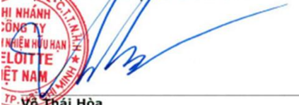
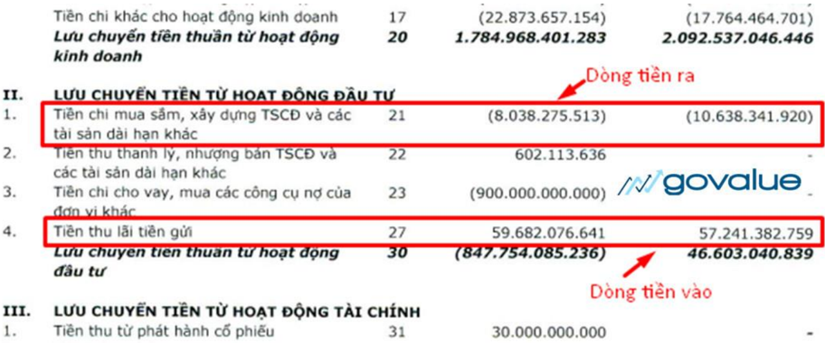
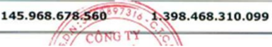
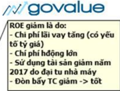
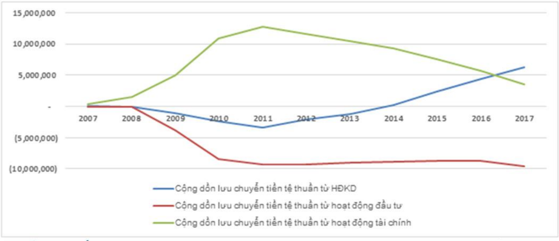

## Hướng dẫn đọc và phân tích báo cáo tài chính (NHANH)

The image presents a close-up view of a newspaper page, with the title "TIMES" prominently displayed in white text on a dark blue background at the top right corner. The page is predominantly white, featuring a mix of black and red text, as well as some green accents. A prominent graph is situated in the center of the page, accompanied by various lines of text that appear to be in German. In the bottom right corner, a blue logo bearing the text "govalue" is visible. The overall atmosphere of the image suggests that it is a stock photo or advertisement for a financial news source, likely intended to convey a sense of professionalism and authority in the field of finance.

## Mục lục

| Báo cáo tài chính là gì?....................................................................................................................4                                                                            |
|--------------------------------------------------------------------------------------------------------------------------------------------------------------------------------------------------------------------------|
| Bước #1: Xem ý kiến của Kiểm toán viên.....................................................................................4                                                                                             |
| Bước #2: Đọc hiểu Bảng cân đối kế toán.....................................................................................6                                                                                             |
|  Tài sản.......................................................................................................................................6                                                                        |
|  Nợ phải trả...............................................................................................................................7                                                                            |
|  Vốn chủ sở hữu.......................................................................................................................8                                                                                 |
|  Cách đọc Bảng cân đối kế toán.............................................................................................8                                                                                            |
|  Ví dụ..........................................................................................................................................9                                                                       |
|  Tips: Nhận diện sớm rủi ro từ Bảng cân đối kế toán: Sự mất cân đối tài chính..........11                                                                                                                               |
| Bước #3: Đọc hiểu Báo cáo kết quả hoạt động kinh doanh ...................................................12                                                                                                             |
|  Hoạt động kinh doanh chính ..............................................................................................12                                                                                            |
|  Hoạt động tài chính..............................................................................................................13                                                                                    |
|  Hoạt động khác.....................................................................................................................14                                                                                  |
|  Lợi nhuận...............................................................................................................................14                                                                             |
|  Cách đọc Báo cáo kết quả hoạt động kinh doanh...........................................................14                                                                                                             |
|  Ví dụ........................................................................................................................................15                                                                        |
|  Tips:.........................................................................................................................................16                                                                       |
| Bước #4: Đọc hiểu Báo cáo lưu chuyển tiền tệ.........................................................................16                                                                                                  |
|  Vì sao Dòng tiền lại quan trọng?.........................................................................................16                                                                                            |
|  Cách đọc Báo cáo lưu chuyển tiền tệ.................................................................................17                                                                                                 |
|  Ví dụ........................................................................................................................................18                                                                        |
|  Cần lưu ý gì khi đọc Báo cáo lưu chuyển tiền tệ?.............................................................22                                                                                                        |
|  Tips: Nhận biết tình hình tài chính lành mạnh của doanh nghiệp thông qua dòng tiền chi trả cổ tức ..................................................................................................................22 |
| Bước #5: Đọc hiểu Thuyết minh báo cáo tài chính...................................................................23                                                                                                     |
|  Ví dụ........................................................................................................................................24                                                                        |
|  Kết luận: .................................................................................................................................35                                                                          |

| Phân tích báo cáo tài chính..........................................................................................................35           |                                                                                                                                       |
|---------------------------------------------------------------------------------------------------------------------------------------------------|---------------------------------------------------------------------------------------------------------------------------------------|
|  Lưu ý gì khi tính toán các chỉ số tài chính..........................................................................36                         |                                                                                                                                       |
| Bước #6: Phân tích khả năng thanh toán ..................................................................................36                       |                                                                                                                                       |
|  Hệ số khả năng thanh toán hiện hành..............................................................................36                             |                                                                                                                                       |
|  Hệ số khả năng thanh toán lãi vay.....................................................................................37                        |                                                                                                                                       |
|  Hệ số vòng quay các khoản phải thu.................................................................................37                           |                                                                                                                                       |
|  Hệ số vòng quay hàng tồn kho...........................................................................................38                       |                                                                                                                                       |
|  Ví dụ........................................................................................................................................39 |                                                                                                                                       |
| Bước #7: Phân tích đòn bẩy tài chính.........................................................................................40                   |                                                                                                                                       |
|  Hệ số nợ của doanh nghiệp bao nhiêu là hợp lý?............................................................40                                    |                                                                                                                                       |
| Bước #8: Phân tích khả năng sinh lời .........................................................................................41                  |                                                                                                                                       |
|  Tỷ suất lợi nhuận sau thuế trên doanh thu ......................................................................41                              |                                                                                                                                       |
|  Tỷ suất lợi nhuận gộp (hay Biên lợi nhuận gộp)...............................................................42                                 |                                                                                                                                       |
|  Tỷ suất lợi nhuận sau thuế trên tổng tài sản....................................................................42                              |                                                                                                                                       |
|  Tỷ suất lợi nhuận sau thuế trên vốn chủ sở hữu.............................................................43                                   |                                                                                                                                       |
|  Thu nhập một cổ phần thường...........................................................................................43                        |                                                                                                                                       |
|  Ví dụ........................................................................................................................................44 |                                                                                                                                       |
|  Tips: Hệ số Dupont...............................................................................................................44             |                                                                                                                                       |
| Bước #9: Phân tích dòng tiền ......................................................................................................46             |                                                                                                                                       |
|  Dòng tiền thuần từ hoạt động kinh doanh/Doanh thu thuần .......................................46                                               |                                                                                                                                       |
|  Tỷ suất dòng tiền tự do........................................................................................................46               |                                                                                                                                       |
|  Phân tích xu hướng dòng tiền.............................................................................................47                     |                                                                                                                                       |
| What's next?                                                                                                                                      | ...................................................................................................................................48 |

Đọc và phân tích báo cáo tài chính là kỹ năng không thể thiếu, không chỉ trong đầu tư cổ phiếu mà trong nhiều mảng khác như quản trị tài chính doanh nghiệp, kiểm toán, kế toán, ngân hàng.

Vấn đề là những kiến thức mà bạn được học ở trường đại học đều không giúp gì nhiều cho bạn.

Tại sao?

Vì bạn không được dạy cách áp dụng những kiến thức đó như thế nào…

Hay những điểm cần chú ý khi phân tích báo cáo tài chính là gì?

Trong bài viết này GoValue sẽ hướng dẫn đầy đủ và chi tiết nhất cho bạn về cách đọc và phân tích báo cáo tài chính, kèm theo cách áp dụng thực tế khi đầu tư chứng khoán.

## Báo cáo tài chính là gì?

Báo cáo tài chính (BCTC) cung cấp thông tin liên quan đến hoạt động tài chính của doanh nghiệp, như: tài sản, nợ, vốn chủ sở hữu, doanh thu, lợi nhuận, dòng tiền…

Báo cáo thường được công bố định kỳ vào cuối mỗi quý và vào cuối năm.

## Bộ báo cáo tài chính hoàn chỉnh bao gồm:

-  Báo cáo của Ban giám đốc
-  Báo cáo của công ty kiểm toán độc lập
-  Bảng cân đối kế toán
-  Báo cáo kết quả hoạt động kinh doanh
-  Báo cáo lưu chuyển tiền tệ
-  Thuyết minh báo cáo tài chính

Bạn nên bắt đầu như thế nào?

## Bước #1: Xem ý kiến của Kiểm toán viên

Rất nhiều người khi đọc BCTC thường bỏ qua phần Ý kiến của kiểm toán, trong khi…

… đây là phần quan trọng đầu tiên mà bạn cần chú ý đến.

## Tại sao?

Các số liệu trên BCTC sẽ không có ý nghĩa nếu kiểm toán không chắc chắn về tính trung thực của nó.

Hãy xem ý kiến của Kiểm toán viên (KTV) đối với báo cáo của doanh nghiệp ở đây là gì?

Có 4 mức độ hay ý kiến của KTV về tính trung thực của 1 bộ báo cáo. Đó là:

-  Chấp nhận toàn phần
-  Ngoại trừ
-  Không chấp nhận
-  Từ chối.

## Ví dụ:

các báng

Phó Tông Giám dôc kiêm toán sô 0138-2018-001-1 CHI NHÁNH CÔNG TY TNHH DELOITTE VIÊT NAM Ngày 31 tháng 01 nym 2018 Thành nghê phô

hop

Trân Kim Long Häi Kiêm toán viên Giãy chúng nhân kiëm toán nghê

sô 1503-2018-001-1

f J govalue

Khi KTV đưa ra ý kiếm kiểm toán là Chấp nhận toàn phần. Điều này có nghĩa BCTC đã phản ánh trung thực, hợp lý…

Bạn có thể tin tưởng và sử dụng báo cáo cho việc phân tích.

Vì nếu BCTC có sai sót đáng kể thì đã được KTV phát hiện và doanh nghiệp đã điều chỉnh theo đề nghị của KTV.

| Không chãp nhân Ngoai trù Chãp nhân toàn phân   |
|-------------------------------------------------|
| Cao                                             |

Mức độ tin cậy của BCTC sẽ giảm dần tương ứng với 4 ý kiến kiểm toán trên.

Và khi ý kiến Từ chối được đưa ra cho BCTC của 1 doanh nghiệp, thì tốt nhất, bạn nên tránh xa doanh nghiệp đó.

## Bước #2: Đọc hiểu Bảng cân đối kế toán

Đây là bảng số liệu quan trọng đầu tiên của doanh nghiệp. Nó thể hiện tình hình tài chính của doanh nghiệp tại một thời điểm nhất định.

'Bảng cân đối kế toán cho bạn biết tại thời điểm này mọi thứ đang ở đâu?'

Kết cấu của Bảng cân đối sẽ gồm 2 phần là Tài sản và Nguồn vốn

Bạn cần nhớ phương trình cân bằng:

Tài sản = Nợ phải trả + Vốn chủ sở hữu

## Tài sản

Đây là những thứ thuộc sở hữu của doanh nghiệp, có khả năng tạo ra lợi ích kinh tế cho doanh nghiệp.

Tài sản được phân thành 2 loại, là: Tài sản ngắn hạn và Tài sản dài hạn.

## Tài sản ngắn hạn

Là những loại tài sản có thể dễ dàng chuyển đổi thành tiền mặt trong vòng dưới 1 năm hoặc 1 chu kỳ kinh doanh.

## Bao gồm các mục chính như:

-  Tiền và tương đương tiền: gồm tiền mặt và tiền gửi ngân hàng. Đây là loại tài sản có tính thanh khoản cao nhất của doanh nghiệp. Khoản mục này cũng là một trong số ít khoản mục ít bị tác động bởi kế toán.
-  Các khoản phải thu: là số tiền mà khách hàng chưa thanh toán (còn nợ) cho doanh nghiệp. Đây là khoản mục mà bạn cần theo dõi sát sao.
-  Hàng tồn kho: Là giá trị hàng dự trữ của doanh nghiệp. Đó có thể là: nguyên vật liệu, bán thành phẩm, thành phẩm hoặc hàng hóa…

Tùy thuộc từng doanh nghiệp mà tỷ trọng phân bổ hàng tồn kho sẽ khác nhau. Ví dụ, một doanh nghiệp sản xuất thì sẽ tồn kho một lượng lớn nguyên vật liệu.

Trong khi đó, doanh nghiệp thương mại thì thường tồn kho chủ yếu là hàng hóa, thành phẩm.

## Tài sản dài hạn

Là những tài sản sẽ có thời gian sử dụng trên 1 năm.

Trong đó, Tài sản cố định là khoản mục quan trọng.

Tài sản cố định bao gồm: Tài sản hữu hình (như máy móc thiết bị, nhà xưởng, máy tính…) và Tài sản vô hình (như bằng sáng chế, bản quyền phát minh…)

## Nợ phải trả

Nợ phải trả và Vốn chủ sở hữu sẽ nằm trong Nguồn vốn, phản ánh nguồn hình thành tài sản của doanh nghiệp.

Nợ phải trả thể hiện nghĩa vụ tài chính của doanh nghiệp đối với bên ngoài.

Ví dụ như: chủ nợ, nhà nước, nhà cung cấp, người lao động…

Tương tự tài sản, Nợ phải trả cũng được chia làm 2 loại: Nợ ngắn hạn và Nợ dài hạn.

Nợ ngắn hạn là những khoản nợ và các nghĩa vụ tài chính phải thanh toán dưới 1 năm.

Nợ dài hạn là những khoản nợ và nghĩa vụ tài chính được phép thanh toán trên 1 năm.

Các khoản mục chính ở phần này bao gồm:

-  Phải trả người bán: Thể hiện số tiền mà doanh nghiệp chưa thanh toán (còn nợ) cho nhà cung cấp.
-  Thuế và các khoản phải nộp nhà nước, Phải trả người lao động…: Tương tự, đây là khoản phải trả của doanh nghiệp đối với nhà nước (về thuế GTGT, thuế TNDN…), phải trả cho người lao động.
-  Vay và nợ ngắn hạn/dài hạn: Là khoản tiền vay nợ tín dụng. Nếu như các khoản nợ trên là nợ chiếm dụng (doanh nghiệp không mất chi phí sử dụng vốn), thì với khoản vay này doanh nghiệp phải trả chi phí sử dụng vốn (trả lãi vay cho ngân hàng).

## Vốn chủ sở hữu

-  Vốn góp chủ sở hữu: hay vốn cổ phần, là số vốn thực tế được góp vào doanh nghiệp.
-  Lợi nhuận chưa phân phối: Nếu trong năm tài chính, doanh nghiệp quyết định tái đầu tư thì phần lợi nhuận giữ lại sẽ được chuyển từ Báo cáo kết quả hoạt động kinh doanh vào tài khoản này.
-  Ngoài ra có các loại quỹ như Quỹ đầu tư phát triển,…

Mục này đại diện cho tổng giá trị tài sản ròng của doanh nghiệp. Để Bảng cân đối kế toán cân bằng thì con số chênh lệch giữa Tài sản và Nợ phải trả sẽ là Vốn chủ sở hữu của doanh nghiệp.

## Cách đọc Bảng cân đối kế toán

-  B1: Liệt kê những mục lớn trong Tài sản - Nguồn vốn.

-  B2: Tính toán tỷ trọng các khoản mục này trong Tài sản và Nguồn vốn, và sự thay đổi của các khoản mục tại thời điểm báo cáo.
-  B3: Note lại những mục chiếm tỷ trọng lớn, hoặc có sự biến động lớn về mặt giá trị ở thời điểm báo cáo.

## Tại sao chúng ta chỉ quan tâm đến những thay đổi lớn và tỷ trọng lớn?

Về lý thuyết, tất nhiên, bạn sẽ phải tìm hiểu tất tần tật những sự thay đổi đang diễn ra trên Bảng cân đối kế toán.

Tuy nhiên công việc đó tốn khá nhiều thời gian, công sức.

Việc lựa chọn những khoản mục chiếm tỷ trọng lớn trong cơ cấu Tài sản - Nguồn vốn giúp bạn trả lời được câu hỏi:

## 'Phần lớn tài sản của doanh nghiệp đang tập trung ở đâu? Nguồn hình thành tài sản của doanh nghiệp chủ yếu đến từ nguồn nào?'

Sự thay đổi của những khoản mục này thường sẽ 'trọng yếu' hơn, quan trọng hơn, và thể hiện rõ hơn tình hình tài chính của doanh nghiệp.

Tất nhiên, nếu muốn, bạn vẫn có thể giành thời gian tìm hiểu thêm những mục còn lại trên Bảng cân đối kế toán.

Chúng ta sẽ lập 1 bảng tính Excel để theo dõi sự thay đổi này.

## Ví dụ

Trong bài viết này, tôi sẽ sử dụng báo cáo tài chính trên Cafe ngày 31/12/2017 của NT2 để làm mẫu.

## PHÀN TÀI SÁN (RÚT GON)

## 1 V govalue

Nguôn: NT2, GoValue tính toán

|                              | 2017      | 2016       |        |        |          |
|------------------------------|-----------|------------|--------|--------|----------|
|                              |           |            | 2017   | 2016   | 2016 (%) |
|                              | (1)       | (2)        |        |        |          |
| A: Tài sán han               | 3,101,036 | 5,316,223  | 31.1%  | 41.09  | 41.7%    |
|                              | 145,969   | 1,398,468  | 1.5%   | 10.8%  | -89.6%   |
| Il. Giá tri thuân dâu tu han | 900,000   |            | 9.0%   | 0.0%   |          |
| IIL. Các khoán phái thu      | 1,795,329 | 3,609,509  | 18.09  | 27.89  | 50.39    |
| IV. tôn kho, Hàng ròng       | 259,378   | 239,011    | 2.6%   | 1.8%   | 8.5%     |
|                              | 360       | 69,235     | 0.0%   | 0.5%   | 99.5%    |
| B. Tài sán dài han           | 6,863,073 | 7,663,691  | 68.9%  | 59.0%  | 10.49    |
| Phái thu dài han             | 37,653    | 202,139    | 0.4%   | 1.6%   | 81.4%    |
|                              | 6,246,943 | 6,934,521  | 62.7%  | 53.4%  | 9.9%     |
| dài han dang                 | 3,661     | 1,404      | 0.09   | 0.0%   | 160.8%   |
| V.Tài sán dài han khác       | 574,817   | 525,626    | 5.8%   | 4.0%   | 9.4%     |
|                              | 9,964,110 | 12,979,914 | 100.0% | 100.0% | -23.2%   |

Cuối năm 2017, tài sản của NT2 đã giảm -23,2% so với cùng kỳ năm 2016.

Tài sản của NT2 tập trung chủ yếu ở: Tiền và các khoản tương đương tiền, Các khoản phải thu ngắn hạn, và Tài sản cố định.

Đây là những khoản mục bạn cần phải quan tâm trước tiên ở phần Tài sản của NT2.

Chúng ta sẽ đi sâu vào tìm hiểu sự thay đổi này khi đến Bước#5 của bài viết ( Đọc hiểu Thuyết minh BCTC ).

Bên cạnh đó, việc tính toán tỷ trọng trong Tài sản cũng giúp bạn đánh giá sơ bộ liệu doanh nghiệp có đầu tư tài sản 1 cách hợp lý?

NT2 là doanh nghiệp sản xuất điện, sở hữu nhà máy nhiệt điện khí Nhơn Trạch 2. Vậy thì rõ ràng tài sản được đầu tư lớn nhất của NT2 sẽ là tài sản là tài sản cố định (cụ thể, chiếm &gt;60% cơ cấu tài sản của doanh nghiệp). Điều này là hợp lý!

|                              | 2017      | 2016       |        |        | 2017 s0 vói   |
|------------------------------|-----------|------------|--------|--------|---------------|
|                              |           |            | 2017   | 2016   | 2016 (%)      |
|                              |           | (2)        |        |        |               |
|                              | 4,978,888 | 8,071,480  | 50.09  | 62.2%  | 38.3%         |
|                              | 2,283,994 | 4,309,602  |        | 33.2%  | 47.09         |
| 1 Vay                        | 1,066,152 | 1,044,961  | 10.7%  | 8.1%   | 2.0%          |
| 2. Phái trà nhà cung cãp han | 921,725   | 2,651,557  | 9.39   | 20.49  | 65.2%         |
|                              | 109,837   | 294,942    | 1.1%   | 2.39   | 62.8%         |
| dông                         | 22,833    | 16,736     | 0.2%   | 0.1%   | 36.4%         |
| 5. Chi phí phái trà          | 103,656   | 92,724     | 1.0%   | 0.7%   | 11.8%         |
|                              | 44,580    | 185,718    | 0.4%   | 1.49   | 76.0%         |
|                              | 15,211    | 22,964     | 0.2%   | 0.2%   | 33.8%         |
| Ny dài han                   | 2,694,893 | 3,761,878  | 27.09  | 29.09  |               |
| 1. dài han Vay               | 2,631,620 | 3,697,297  | 26.49  | 28.59  | 28.8%         |
|                              | 23,281    | 23,866     | 0.2%   | 0.2%   |               |
|                              | 39,992    | 40,714     | 0.4%   | 0.3%   | 1.8%          |
|                              | 4,985,222 | 4,908,434  |        | 37.8%  | 1.6%          |
|                              | 4,985,222 | 4,908,434  | 50.09  | 37.8%  | 1.6%          |
|                              | 2,878,760 | 2,848,760  | 28.9%  | 21.9%  | 1.1%          |
| 2.                           | (458)     | (210)      | 0.0%   | 0.09   | 118.1%        |
|                              | 137,295   | 137,295    | 1.49   | 1.1%   | 0.0%          |
|                              | 1,969,624 | 1,922,589  | 19.89  | 14.89  | 2.4%          |
|                              | 9,964,110 | 12,979,914 | 100.09 | 100.09 | 23.2%         |

govalue

Tương tự, các khoản mục cần chú ý ở Nợ phải trả là:

-  Phải trả nhà cung cấp ngắn hạn;
-  Vay ngắn hạn;
-  Vay dài hạn.

Và, những thay đổi ở Vốn chủ sở hữu là:

-  Vốn góp của CSH;
-  Và, Lợi nhuận sau thuế chưa phân phối.

Tips: Nhận diện sớm rủi ro từ Bảng cân đối kế toán: Sự mất cân đối tài chính

Nguçn: NT2, GoValue tinh toán

Một trong những yếu tố quan trọng của sự cân đối tài chính đó là tài sản dài hạn cần được tài trợ bởi nguồn vốn dài hạn tương ứng.

Một doanh nghiệp tài trợ cho 1 dự án đầu tư dài hạn 15 năm chỉ bằng khoản vay 6 năm thì, không sớm thì muộn, điều này sẽ tiềm ẩn rủi ro lớn và đem đến áp lực về khả năng thanh toán cho doanh nghiệp.

Để sớm nhận biết được điều này, bạn cần quan sát xu hướng biến động của Vốn lưu động thuần (NWC):

## Net working capital (NWC) = Tài sản ngắn hạn - Nợ ngắn hạn

Nếu NWC có xu hướng giảm dần và đặc biệt chuyển sang âm lớn thì điều này đang báo hiệu sự xuất hiện ngày càng rõ rệt của mất cân đối tài chính. NWC &lt; 0, cho thấy công ty đã dùng nợ ngắn hạn tài trợ cho tài sản dài hạn.

Bạn có thể tìm hiểu thêm: 10 chỉ số bảng cân đối mà mọi nhà đầu tư đều cần phải biết khi đầu tư chứng khoán.

## Bước #3: Đọc hiểu Báo cáo kết quả hoạt động kinh doanh

Chúng ta sẽ chuyển sang báo cáo quan trọng thứ 2, Báo cáo kết quả hoạt động kinh doanh (KQKD).

Báo cáo KQKD là báo cáo tổng kết doanh thu, chi phí hoạt động của doanh nghiệp trong kỳ báo cáo (quý hoặc năm tài chính).

Báo cáo KQKD chia hoạt động của doanh nghiệp thành 3 mảng: Hoạt động kinh doanh chính (hoạt động cốt lõi), Hoạt động tài chính và Hoạt động khác.

Công thức chung ở phần này là: Lợi nhuận = Doanh thu - Chi phí

## Hoạt động kinh doanh chính

Bao gồm các khoản mục:

-  Doanh thu thuần về bán hàng và cung cấp dịch vụ: Đây là doanh thu từ hoạt động kinh doanh 'nòng cốt' của doanh nghiệp (sau khi trừ các Khoản giảm trừ doanh thu). Thông thường, đây là hoạt động chiếm tỷ trọng lớn nhất trong cơ cấu doanh thu.
-  Giá vốn hàng bán: Thể hiện tất cả chi phí để làm ra hàng hóa, dịch vụ đã cung cấp.
-  Lợi nhuận gộp = Doanh thu thuần BH, CCDV - Giá vốn hàng bán
-  Chi phí bán hàng, chi phí quản lý doanh nghiệp (QLDN).

Bạn có thể tính toán chỉ số:

Biên lợi nhuận gộp = Lợi nhuận gộp / Doanh thu thuần về bán hàng, CCDV Chỉ số này cho biết…

…tỷ suất lợi nhuận thu được từ bán hàng và CCDV của doanh nghiệp là bao nhiêu? Hệ số này nếu được doanh nghiệp duy trì ổn định, ở mức cao trong dài hạn, chứng tỏ doanh nghiệp có lợi thế cạnh tranh khá rõ nét.

## Hoạt động tài chính

## Bao gồm các mục:

-  Doanh thu tài chính: có từ các nguồn như: lãi tiền gửi, lãi từ nhận đầu tư, lãi chênh lệch tỷ giá…
-  Chi phí tài chính: gồm có chi phí lãi vay, lỗ chênh lệch tỷ giá, dự phòng các khoản đầu tư tài chính,… phát sinh trong kỳ báo cáo của doanh nghiệp.

Trong đó: Chi phí lãi vay và Lỗ chênh lệch tỷ giá (nếu có) là 2 loại chi phí quan trọng mà bạn cần chú ý.

Lấy doanh thu trừ đi chi phí ở 2 hoạt động này, ta được Lợi nhuận thuần:

Lợi nhuận thuần từ hoạt động kinh doanh = Lợi nhuận thuần + Doanh thu TC - Chi phí TC - Chi phí BH, QLDN

## Hoạt động khác

Những gì không nằm trong hoạt động kinh doanh chính và hoạt động tài chính thì sẽ nằm hết ở đây. Thông thường, hoạt động này chiếm tỷ trọng rất nhỏ trong cơ cấu kinh doanh của doanh nghiệp.

-  Thu nhập khác: có nguồn từ lãi thanh lý, nhượng bán tài sản hay được bồi thường hợp đồng…
-  Chi phí khác: Trái ngược với thu nhập khác, chi phí khác sẽ có nguồn từ lỗ thanh lý, nhượng bán tài sản, phải bồi thường vi phạm hợp đồng…
-  Lợi nhuận khác = Thu nhập khác - Chi phí khác

## Lợi nhuận

Tổng hợp lợi nhuận từ những nguồn trên, chúng ta sẽ có được Lợi nhuận trước thuế:

## Lợi nhuận trước thuế = Lợi nhuận thuần từ hoạt động kinh doanh + Lợi nhuận khác

(trừ) khoản Thuế thu nhập doanh nghiệp (TNDN) nộp cho nhà nước, ta sẽ được Lợi nhuận sau thuế.

## Lợi nhuận sau thuế = Lợi nhuận trước thuế - Thuế TNDN

Đây là khoản lợi nhuận thuộc sở hữu của doanh nghiệp và cổ đông.

## Cách đọc Báo cáo kết quả hoạt động kinh doanh

Cách thức thực hiện sẽ tương tự như việc bạn đọc Bảng cân đối kế toán.

Tuy nhiên, trước khi bắt đầu, bạn nên nhóm riêng doanh thu, chi phí để có thể theo dõi sự biến động dễ dàng hơn.

-  B1: Tách riêng doanh thu và chi phí.
-  B2: Tính toán tỷ trọng của từng doanh thu trong Tổng doanh thu, tỷ trọng từng chi phí trong Tổng chi phí, và sự thay đổi của chúng so với cùng kỳ.

-  B3: Quan sát sự thay đổi.

Tiếp tục với ví dụ của chúng ta.

Ví dụ

|                       | 2017      | 2016      |       |       |        |
|-----------------------|-----------|-----------|-------|-------|--------|
|                       |           |           | 2017  | 2016  | 2016   |
| Doanh thu             | 6,825,580 | 8,087,220 |       |       | 15.6%  |
| hàng                  | 6,761,130 | 7,983,298 | 99.1% | 98.7% | 15.39  |
| Doanh thu tài chinh   | 62,996    | 103,162   | 0.9%  | 1.39  | -38.9% |
| Thu nhâp khác         | 1,454     | 760       | 0.0%  | 0.0%  |        |
| Chi phí Tóng          | 5,972,142 | 6,939,040 |       |       | 13.9%  |
| bán hàng              | 5,368,442 | 6,631,836 | 89.9% | 95.6% | 19.1%  |
| Chi phi tài chinh     | 489,571   | 249,014   | 8.2%  |       | 96.6%  |
| Chí phi bán QLDN hàng | 113,928   | 56,842    |       | 0.8%  |        |
| Chi phi khác          | 201       | 1,348     | 0.0%  | 0.0%  |        |
|                       | 1,392,688 | 1,351,462 |       |       | 3.1%   |
|                       | 853,439   | 1,148,181 |       |       |        |
| Thup TNDN             | 43,026    | 62,673    |       |       |        |
|                       | 810,413   | 1,085,508 |       |       | 25.3%  |

Nguçn: NT2, GoValue tinh toán

Biên LNG (%)

16.9%

Thup suãt TNDN (%)

Việc phân loại giúp chúng ta dễ theo dõi và quan sát sự thay đổi của doanh thu và chi phí. Cụ thể năm 2017:

-  Doanh thu từ hoạt động kinh doanh cốt lõi của NT2 (chiếm 99% tổng doanh thu) đã giảm 15,3% so với 2016.
-  Giá vốn hàng bán giảm 19,1% và tỷ trọng trong tổng chi phí giảm từ 95,6% xuống 89,9%. Điều này giúp cho Lợi nhuận gộp của NT2 cải thiện, tăng 3,1%.
-  Chi phí tài chính là yếu tố cần quan tâm khi mà tỷ trọng của nó tăng gấp 2,3 lần, chiếm 8,2% tổng chi phí. Xét về mặt giá trị, khoản chi phí này đã tăng tới 96,6% so với cùng kỳ.

-  Chi phí bán hàng, QLDN cũng có sự thay đổi lớn về mặt giá trị, mặc dù tỷ trọng trong chi phí chiếm chưa tới 2%.

Như vậy, tổng doanh thu giảm 15,6%, lớn hơn mức giảm của tổng chi phí (giảm 13,9%) đã khiến LNTT của NT2 giảm 25,7% so với cùng kỳ, đạt 853 tỷ đồng.

Và sau khi trừ thuế TNDN, số Lợi nhuận sau thuế của NT2 còn 810 tỷ đồng, giảm 25,3% so với 2016.

Như vậy, bạn sẽ cần phải tìm hiểu:

-  Vì sao doanh thu sụt giảm? NT2 gặp yếu tố bất lợi nào dẫn đến sụt giảm doanh thu trong năm 2017?
-  Yếu tố sản xuất đầu vào của NT2 là gì? Trong đó, yếu tố nào ảnh hưởng lớn tới giá vốn của NT2?
-  Vì sao chi phí tài chính và chi phí bán hàng, QLDN lại gia tăng đột biến trong năm 2017?

Những vấn đề này sẽ được giải đáp trong các bước tiếp theo của bài viết.

## Tips:

Bạn có thể tìm hiểu thêm: Bật mí bí kíp đọc và phân tích báo cáo tài chính của Warren Buffett.

## Bước #4: Đọc hiểu Báo cáo lưu chuyển tiền tệ

## 'Để kiếm tiền chúng ta phải chi tiền'

Báo cáo Lưu chuyển tiền tệ (LCTT) cho biết doanh nghiệp thực sự kiếm được bao nhiêu tiền và tiêu bao nhiêu tiền trong khoảng thời gian nhất định.

## Vì sao Dòng tiền lại quan trọng?

Thực tế, khá nhiều nhà đầu tư xem nhẹ, thậm chí là bỏ qua báo cáo LCTT khi đọc BCTC.

Đừng làm như vậy!

Bởi vì:

Nếu bỏ qua bước này, bạn rất dễ bị qua mặt bởi các báo cáo có lợi nhuận tốt đẹp mà không hiểu được tính bền vững của lợi nhuận này.

Ở Báo cáo KQKD, doanh thu và lợi nhuận sẽ được doanh nghiệp ghi nhập ngay khi bán hàng, kể cả chưa nhận được tiền từ khách hàng. Thực tế, khách hàng sẽ thanh toán cho doanh nghiệp vào 1 thời điểm nào đó, có thể vài tháng, vài năm hoặc không bao giờ.

Tương tự, doanh nghiệp mua hàng từ nhà cung cấp A, mặc dù chưa thanh toán hết tiền nhưng trong kho đã có hàng, hoặc thậm chí là đã được đem bán.

Như vậy, báo cáo lưu chuyển tiền tệ ghi lại dòng tiền vận động trong doanh nghiệp như thế nào?

## Cách đọc Báo cáo lưu chuyển tiền tệ

Báo cáo lưu chuyển tiền tệ đã được trình bày thành 3 phần tương ứng với 3 dòng tiền: Dòng tiền từ hoạt động kinh doanh, Dòng tiền từ hoạt động đầu tư, và Dòng tiền từ hoạt động tài chính.

-  Dòng tiền từ hoạt động kinh doanh: là dòng tiền phát sinh trong quá trình thanh toán cho nhà cung cấp, khách hàng, cho người lao động, chi trả lãi vay, và nộp các khoản thuế cho nhà nước… Đây là lượng tiền mặt mà bản thân doanh nghiệp làm ra, chứ không phải từ việc huy động thêm vốn đầu tư hay vay nợ.
-  Dòng tiền từ hoạt động đầu tư: bao gồm dòng tiền vào và dòng tiền ra có liên quan đến hoạt động đầu tư, mua sắm, thanh lý… tài sản cố định và các tài sản dài hạn khác.
-  Dòng tiền từ hoạt động tài chính sẽ liên quan đến việc tăng/giảm vốn chủ sở hữu (nhận vốn góp mới, thu từ phát hành cổ phiếu, trả cổ tức cho cổ đông…) và vay nợ (chi trả nợ gốc vay, hay vay nợ mới nhận được…)

Vậy nên, bạn chỉ cần xem xét lần lượt từng dòng tiền là được.

## Dòng tiền vào, dòng tiền ra được thể hiện như thế nào trên Báo cáo lưu chuyển tiền tệ?

-  Trên báo cáo LCTT, dòng ti ề n ra sẽ là 1 con số âm, đi kèm với các từ ngữ như 'tiền chi để …', '… đã trả'.
-  Trong khi đó, dòng ti ề n vào sẽ được thể hiện bởi các từ ngữ như 'tiền thu từ…', '… nhận được' và về mặt con số sẽ là số dương.

The image presents a table with four rows and three columns, featuring black text in Vietnamese. The first column contains numbers, while the second and third columns display text. The first row is highlighted in red, with the second and fourth rows also outlined in red. The second row is further emphasized by a red arrow pointing to it, accompanied by the text "Dòng tiền ra" in red. The third row features a blue logo with the word "govalue" in blue text, alongside a red arrow pointing to it and the text "Dòng tiền vào" in red. The background of the image is white.

|     | Tiên chi khác cho hoat dông kinh doanh   |    | (22.873.657.154)           | (17.764,464.701)          |
|-----|------------------------------------------|----|----------------------------|---------------------------|
|     |                                          | 20 | 1.784.968.401.283          | 2.092.537.046.446         |
|     | kinh doanh                               |    | tiên ra                    | tiên ra                   |
| II  |                                          |    | Dong                       | Dong                      |
|     |                                          | 21 | (8.038.275.513)            | (10.638.341.920)          |
| 2   |                                          |    | 602.113.636                |                           |
| 3.  |                                          | 23 | (900.000.000.000) govalue  | (900.000.000.000) govalue |
|     |                                          | 27 | 59.682.076.641             | 57.241.382.759            |
|     |                                          | 30 | 754.085.236 46.603.040.839 |                           |
|     |                                          |    | Dòng tiên vào              | Dòng tiên vào             |
| III |                                          |    |                            |                           |
| 1   |                                          | 31 |                            |                           |

## Ví dụ

Tiếp tục với BCTC 2017 của NT2.

## Đọc Lưu chuyển tiền từ hoạt động kinh doanh

Cơ sở bắt đầu là từ ' Lợi nhuận trước thuế (01) ' với số tiền 853 tỷ đồng, và điều chỉnh cho những khoản mục không làm phát sinh dòng tiền (từ mục 02 đến 06). Bao gồm:

1  govalue

Don vi: VND

| CHI TIÊU   | govalue                                | Mã sô   |                     | Nam truóc           |
|------------|----------------------------------------|---------|---------------------|---------------------|
| 1.         |                                        | 01      | 853.438.866.505     | 1.148.181.112.937   |
| 2          | Díêu chinh cho các khoan:              |         |                     |                     |
|            |                                        | 02      | 692.728.914.680     | 694.373.166.889     |
|            |                                        | 03      | (585.445.921)       | (30.098.378.062)    |
|            | ngoai giá                              | 04      | 234.688.984.672     | (38.496.893.255)    |
|            |                                        | 05      | (60.863.787.502)    | (58.964.396.649)    |
|            |                                        | 06      | 120.327.680.247     | 155.984,.410.804    |
| 3          | Lgi nhuân tù hoat dông kinh doanh      | 08      | 1.839.735.212.681   | 1.870.979.022.664   |
|            |                                        | 09      | 2.033.975.998.362   | (1.885.427.380.067) |
|            | Tang, háng tôn kho giám                | 10      | (20.366.997.003)    | 48.982.004.054      |
|            |                                        | 11      | (1.837.184.635.295) | 2.204.648.970.824   |
|            | giám chi Tang, phí                     | 12      | (35.075.501.443)    | 109.154.326.001     |
|            | Tiên lãi vay dã trà                    | 14      | (123,463.107,.866)  | (157.273.282.628)   |
|            | Thuë thu nháp doanh nghiêp dã nôp      | 15      | (49.778.892,999)    | (80.762.149.701)    |
|            | Tiên chi khác cho hoat dông kinh doanh | 17      | (22.873.657.154)    | (17.764.464.701)    |
|            | kinh doanh                             | 20      | 1.784.968.401.283   | 2.092.537.046.446   |

-  Mục ' Kh ấu hao TSCĐ và BĐS đầu tư (02) ': Số tiền mua sắm TSCĐ thực chất đã chi ra từ lâu. Trong quá trình sử dụng, tài sản đó được trích khấu hao hàng năm. Như vậy, chi phí khấu hao là có, nhưng không có tiền chảy ra. Do đó, được cộng bổ sung (add-back) vào Lợi nhuận trước thuế.
-  ' Các kho ả n d ự phòng (03) ' là  chi phí dự phòng được doanh nghiệp trích lập nhưng thực tế là không chi.
-  ' L ỗ /(Lãi) chênh l ệ ch t ỷ giá… (04) ' xuất phát từ việc tỷ giá đồng ngoại tệ thay đổi.
-  'C hi phí lãi vay (06) ': Chi phí lãi vay là dòng tiền ra. Tuy nhiên đã được trừ khi tính lợi nhuận (thể hiện ở chi phí tài chính trên Báo cáo KQKD), nên sẽ được cộng trở lại.

Cộng ' Lợi nhuận trước thuế (01) ' với ' Các khoản điều chỉnh (từ 02 đến 06) ', ta được ' Lợi nhuận từ hoạt động kinh doanh trước thay đổi vốn lưu động (08) '.

## Cần quan tâm điều gì?

Bạn hãy chú ý khoản mục chiếm tỷ trọng lớn là ' Khấu hao TSCĐ… '.

Khoản mục này thể hiện doanh nghiệp mất bao nhiêu tiền để duy trì hoạt động hàng năm.

LNTT năm 2017 của NT2 hơn 853 tỷ đồng, nhưng mất tới 693 tỷ đồng cho khấu hao, tương ứng 81%. Đây là con số khá lớn.

## Hãy để ý!

Vậy khi tài sản khấu hao hết nhưng vẫn được sử dụng, nó sẽ làm tăng lợi nhuận thực sự cho NT2 (vì không phải khấu trừ khấu hao nữa).

Các mục từ 09 đến 17 thì khá dễ hiểu. Đây là những khoản tiền thực tế chi ra, thu vào của doanh nghiệp trong năm.

Lấy ' Lợi nhuận sau điều chỉnh (08)' cộng dồn cho các mục từ 09 đến 17, ta sẽ ra ' Lưu chuyển tiền thuần từ hoạt động kinh doanh (20)' của NT2, đạt 1.785 tỷ đồng trong năm 2017.

## Đọc Lưu chuyển tiền từ hoạt động đầu tư

-  Trong kỳ, NT2 chi khoảng 8 tỷ đồng để mua sắm, bổ sung TSCĐ và tài sản dài hạn khác, chiếm 0,9% LNTT.

Đối với NT2, hay các nhà máy điện khác nói chung, điều này là hợp lý! Vì họ chỉ đầu tư TSCĐ ban đầu lớn, và ít phát sinh hoạt động đầu tư sau này.

Trong khi đó, một doanh nghiệp đang trong quá trình đầu tư tài sản thì tỷ trọng này sẽ khá lớn.

21

(8.038.275.513)

(10,638.341.920)

- 2

22

602 113.636

f J govalue

- 3 cu no cúa don vi khác công

23

(900.000.000.000)

- 27 Luu chuyên tíên thuân tù hoat dông 30 dsu tu

59.682.076.641

57.241.382.759

(847.754.085.236)

46.603.040.839

-  Ở đây, bạn cũng cần chú ý, 900 tỷ - số tiền được chi ra để cho vay, mua các công cụ nợ của đơn vị khác.

Cộng dồn các khoản mục, ta được ' Lưu chuyển tiền thuần từ hoạt động đầu tư (30)' thể hiện sự chênh lệch giữa dòng tiền ra và dòng tiền vào lên đến 847 tỷ đồng, mà chủ yếu là do khoản 900 tỷ bất thường gây ra.

## Đọc Lưu chuyển tiền từ hoạt động tài chính

Mục 31 là khoản tiền thu từ phát hành cổ phiếu. Mục 34 là khoản tiền chi trả phần nợ gốc của khoản vay. Và mục 36 là dòng tiền chi trả cổ tức cho cổ đông.

|    | III                                              | III                                       | 1 v                                       |
|----|--------------------------------------------------|-------------------------------------------|-------------------------------------------|
| 1  | 31                                               |                                           |                                           |
| 2  | 34                                               | (1.330.125.481.812)                       | (1.060.713.743.759)                       |
| 3  | 36                                               | (889.588.474,445)                         | (788,459.445.790)                         |
|    | 40                                               | (2.189.713.956.257)                       | (1.849.173.189.549)                       |
|    | Luu chuyen tiên thuân trong nám 50 (50=20+30+40) | (1.252.499.640.210)                       | 289.966.897.736                           |
|    | 60                                               | 1.398.468.310.099                         | 1.108.501.344.977                         |
|    | hôi doái 61 thay giá                             | 8.671                                     | 67.386                                    |
|    |                                                  | 145.968.678.560 1.398.468.310.099 CONG TY | 145.968.678.560 1.398.468.310.099 CONG TY |

Có thể thấy, NT2 hiện không có khoản vay mới nào trong năm.

Bên cạnh đó, doanh nghiệp rất chủ động trong việc trả nợ vay hàng năm. Trong năm 2017, NT2 chi khoảng 1.330 tỷ để thanh toán nợ gốc. Điều này giúp làm giảm tỷ trọng và giá trị của khoản mục Vay dài hạn trên bảng cân đối.

Việc giảm nợ vay là một tín hiệu tốt. Tình hình tài chính của doanh nghiệp đang dần được cải thiện. Rủi ro thanh toán cũng nhờ thế mà giảm.

Cộng các khoản mục từ 31 đến 36 ta được ' Lưu chuyển tiền thuần từ hoạt động tài chính (40) '.

Cộng ba mục Lưu chuyển tiền thuần từ hoạt động kinh doanh, từ đầu tư và từ hoạt động tài chính, ta thu được ' Lưu chuyển tiền thuần trong năm (50) ' là -1.252 tỷ đồng.

Tại thời điểm đầu năm 2017, NT2 đang có 1.398 tỷ đồng tiền và tương đương tiền. Và, cuối năm số tiền này đã giảm xuống còn 146 tỷ đồng.

## Cần lưu ý gì khi đọc Báo cáo lưu chuyển tiền tệ?

Có 3 vấn đề bạn cần lưu ý:

-  Thứ nhất: Trong 3 nhóm, thì nhóm 2 và 3 có bản chất là tăng ở kỳ hiện tại, giảm ở kỳ tương lai, hoặc ngược lại.

Doanh nghiệp đi vay 10 tỷ thì trong tương lai sẽ phải có khoản trả lại 10 tỷ. Đã có mua mới tài sản thì ắt phải có thanh lý tài sản…

-  Thứ hai: Trọng tâm nghiên cứu là Lưu chuyể n ti ề n t ệ t ừ ho ạt độ ng kinh doanh. Vì nó thể hiện khả năng tạo ra tiền thực tế của doanh nghiệp.

Lưu chuyển tiền thuần từ hoạt động kinh doanh năm 2017 là 1.785 tỷ đồng, đây không phải là khoản lợi nhuận thực của NT2 mà bao gồm cả các khoản phải thu, phải trả…

Tuy nhiên, nếu đều đặn hàng kỳ, dòng tiền này của NT2 luôn mang số dương, có nghĩa là vẫn có dòng tiền đổ vào.

Đó là điều tốt.

Còn nếu nhiều kỳ liên tiếp, dòng tiền hoạt động mang dấu âm, có nghĩa là dòng tiền chảy ra. Doanh nghiệp sẽ phải đi vay tiền để tạo dòng tiền bù đắp.

Tiền và tương đương tiền cuối kỳ vẫn dương, nhưng thực tế lại đang dựa trên những khoản nợ vay.

-  Thứ ba: Tiền và các khoản tương đương tiền cuối kỳ có thể giảm so với kỳ trước. Đây chưa hẳn là điều xấu, vì doanh nghiệp đã trả các khoản vay của mình trước đó. Như ở ví dụ trên của chúng ta.

## Tips: Nhận biết tình hình tài chính lành mạnh của doanh nghiệp thông qua dòng tiền chi trả cổ tức

Một trong những dấu hiệu thể hiện tình hình tài chính lành mạnh của doanh nghiệp chính là: dòng tiền trả cổ tức đều đặn trong dài hạn.

Ngoại trừ những doanh nghiệp đang trong thời kỳ tăng trưởng nhanh có thể không trả cổ tức. Còn trong các trường hợp khác, việc kinh doanh có lãi cần đi kèm với một chính sách chi trả cổ tức bằng tiền cho cổ đông.

Việc doanh nghiệp chi trả cổ tức bằng tiền ổn định, đều đặn hàng năm là dấu hiệu quan trọng để chứng tỏ sự lành mạnh về dòng tiền và lợi nhuận mà doanh nghiệp công bố là thực chất.

Bạn có thể tìm hiểu thêm: 7 chỉ số dòng tiền mà mọi nhà đầu tư cần phải biết nếu không muốn suốt ngày thua lỗ

## Bước #5: Đọc hiểu Thuyết minh báo cáo tài chính

Thuyết minh BCTC cung cấp cho bạn thông tin chi tiết các thông tin số liệu đã trình bày ở các Bảng CĐKT, Báo cáo KQKD, Báo cáo LCTT và các thông tin cần thiết khác theo chuẩn mực kế toán cụ thể.

Thuyết minh BCTC sẽ bao gồm những nội dung:

-  Đặc điểm hoạt động của doanh nghiệp;
-  Kỳ kế toán và đơn vị tiền tệ sử dụng trong kế toán;
-  Chuẩn mực kế toán và chế độ kế toán áp dụng;
-  Các chính sách kế toán áp dụng;
-  Thông tin bổ sung cho các khoản mục trên Bảng cân đối kế toán;
-  Thông tin bổ sung cho các khoản mục trên Báo cáo KQKD;
-  Thông tin bổ sung cho các khoản mục trên Lưu chuyển tiền tệ.

## Cách đọc Thuyết minh báo cáo tài chính

Chúng ta sẽ chia Thuyết minh BCTC ra thành 2 phần:

## Phần 1: Tìm hiểu về về doanh nghiệp

Bao gồm: đặc điểm hoạt động của doanh nghiệp, kỳ kế toán, các chuẩn mực và chính sách kế toán mà doanh nghiệp áp dụng.

Ở phần này, bạn sẽ phải trả lời được những câu hỏi sau:

-  Ngành nghề hoạt động của doanh nghiệp là gì?

Bạn phải hiểu doanh nghiệp mà mình đang tìm hiểu đang hoạt động trong ngành nghề gì? Vì mỗi ngành nghề khác nhau, thì các con số trên BCTC sẽ có ý nghĩa khác nhau.

Ví dụ: Doanh nghiệp sản xuất sẽ phải đầu tư nhà xưởng, máy móc,… thì tài sản cố định sẽ lớn.

Trong khi, đối với một doanh nghiệp bán lẻ thì các khoản phải thu sẽ ít, và hàng tồn kho có thể cao.

-  Doanh nghiệp hoạt động từ bao giờ? Việc này giúp bạn có thể hình dung được doanh nghiệp đang ở giai đoạn đầu, giữa hay cuối chu trình phát triển.
-  Các chính sách kế toán, chuẩn mực kế toán doanh nghiệp đang áp dụng ra sao?

Những thông tin này, bạn hoàn toàn có thể tìm thấy ở đoạn đầu của Thuyết minh BCTC.

## Phần 2: Thuyết minh về các khoản mục trên BCTC

Ở các bước #2, 3 và 4 phía trên, chúng ta đã note lại những khoản mục cần lưu ý, có sự thay đổi lớn so với cùng kỳ.

Giờ là lúc bạn đi đến phần thuyết minh của những khoản mục đó để tìm hiểu lý do.

Bạn có thể kết hợp đọc song song Thuyết minh BCTC khi bạn đang xem xét Bảng cân đối kế toán và Báo cáo KQKD.

## Ví dụ

Chúng ta sẽ đi vào từng phần…

## Tìm hiểu về doanh nghiệp

## 1 THÔNG TIN KHÁI QUÁT

Ke hoach va Nai cap va dieu Chinh gan nhat 3600897316 ngày 05 tháng 01 nfm 2018.

Tông sô nhân viên cua tháng 12 nfm 2016: 190 nguòi). Công

## Ngành kinh doanh nghê

Ngành kinh doanh cúa Công ty là: nghê

- Bán buôn nhiên liêu ran,
- Vân tái hàng hóa duòng bô;
- Kho bãi và luu hoá; hàng
- Bán buôn thiêt bi vât tu, phu tùng máy khác;
- Giáo duc nghiêp; nghê
- Hoat dông chuyên khoa hoc và công nghê khác; môn,
- hóa duòng thúy nôi dia; hàng

## Hoat dông chinh

quá 12 tháng.

-  Hoạt động chính của NT2 là vận hành các công trình điện, mà cụ thể ở đây là nhà máy nhiệt điện khí Nhơn Trạch 2 - một nhà máy sản xuất điện.
-  NT2 thành lập từ năm 2007. Doanh nghiệp đã hoạt động được 11 năm.

Thông thường, 25 năm là khoảng thời gian vận hành trung bình của một nhà máy nhiệt điện khí. Như vậy, NT2 đã hoạt động xấp xỉ 1/2 vòng đời của nhà máy.

## 2.

Viêt Nam ("VND"), theo nguyên tEc gôc và phù Dông giá hop chãp nhân chung tai các nuóc khác ngoài Viêt Nam. govalue

## Nãm tài chính

-  BCTC của NT2 được lập đúng theo chuẩn mực và các nguyên tắc kế toán của Việt Nam.
-  Năm tài chính của NT2 là từ ngày 01/01 đến 31/12, tương đương với 1 năm dương lịch.

Bạn cần lưu ý vấn đề này, vì có 1 số BCTC được lập theo chu kỳ kinh doanh của ngành.

Ví dụ như kỳ báo cáo của Tập đoàn Hoa Sen (HSG) sẽ từ 01/10 năm trước đến 30/9 năm nay.

Khi đó, bạn sẽ không thể so sánh số liệu của HSG với một doanh nghiệp có kỳ báo cáo từ 01/01 đến 31/12 được.

Tiếp đến, bạn sẽ đọc các nguyên tắc hay chính sách kế toán được NT2 áp dụng trong việc lập BCTC để biết được các con số được ghi nhận như thế nào?

Bây giờ, chúng ta sẽ chuyển tiếp sang Đọc thuyết minh các khoản mục trên BCTC.

## Thuyết minh Bảng cân đối kế toán

Những vấn đề chúng ta cần làm rõ ở Bảng cân đối kế toán là:

-  Tiền và các khoản tương đương tiền
-  Các khoản phải thu ngắn hạn
-  Tài sản cố định

-  Phải trả người bán ngắn hạn
-  Vay ngắn hạn và Vay dài hạn
-  Vốn góp chủ sở hữu
-  Lợi nhuận sau thuế chưa phân phối

Hãy đi vào từng mục:

## a. Tiền và các khoản tương đương tiền :

Tại ngày 31/12/2016, Ti ền và tương đương tiề n của NT2 là 1.398 tỷ (chiếm 10,8% trên tổng tài sản), thì sang đến 31/12/2017, tỷ lệ này giảm xuống còn 1,5% (tương đương giảm -89,6%).

Mức giảm khá mạnh!

## 4.

|                                |                 | Sô dâu nam        |
|--------------------------------|-----------------|-------------------|
|                                | 120.412.220     | 22.500.916        |
| Tiên g6 hàng không ky han ngân | 75.848.266.340  | 133.445.809.183   |
| Các khoán tuong duong tiên     | 70.000.000.000  |                   |
|                                | 145.968.678.560 | 1.398.468.310.099 |

các ngân hàng thuong ty dông gia han nêu ty không Yêu câu tât toán tai ngày dáo han. Công

## 5.

## f J govalue

6

Ở đây, bạn sẽ thấy, khoản mục Đầu tư tài chính ngắn hạn của NT2 có 1 khoản 900 tỷ, chiếm 9,0% tổng tài sản. Số tiền này được NT2 giải thích là đang gửi tiết kiệm có kỳ hạn tại ngân hàng.

Điều này cũng giúp lý giải vì sao ở Báo cáo LCTT có 1 khoản chi 900 tỷ cho hoạt động đầu tư. Bạn còn nhớ chứ!

Cộng số tiền này với Tiền và tương đương tiền, ta được tỷ trọng là 10,5%. Không có quá nhiều thay đổi so với mức 10,8% tại ngày 31/12/2016.

Như vậy, lượng tiền mặt của doanh nghiệp khá ổn định, dồi dào (&gt;1.000 tỷ đồng).

NT2 biết sử dụng khoản tiền nhàn rỗi gửi tiết kiệm, tăng nguồn thu cho doanh nghiệp.

## b. Các khoản phải thu :

Tương tự, tại 31/12/2016, các khoản phải thu chiếm 27,8% tổng tài sản thì tại ngày 31/12/2017, tỷ lệ này giảm còn 18,0% (tương ứng giảm -50,3% về mặt giá trị).

Hãy cùng tìm hiểu!

## 6. PHÁI THU CUA KHÁCH HÀNG

## f J govalue

| a, Phài thu han cúa khách hàng Công   | VND 1.682.136.342.319 48.102.576   | VND 3.447.370.559.194   |
|---------------------------------------|------------------------------------|-------------------------|
| khác                                  |                                    | 75.132.578              |
|                                       | 1.682.184.444.895                  | 3.447.445.691.772       |
| b. Phái thu dài han cúa khách hàng    |                                    | 164.486.554.947         |
|                                       |                                    | 164.486.554.947         |

chú yëu là khoán tiên diên tam tinh phái thu mua sung; và khoán tiên diên bô sung theo hàng giá dông giá

Ban Giám dôc Công ty dánh giá

Sự thay đổi này chủ yếu đến từ Ph ả i thu ng ắ n h ạ n c ủ a khách hàng .

Cụ thể là từ khách hàng chính của NT2 là Công ty Mua bán điện (EPTC).

Tất nhiên, NT2 vận hành nhà máy nhiệt điện, nên lượng điện sản xuất ra sẽ được bán cho EPTC.

Dư nợ tại thời điểm 31/12/2017 còn 1.682 tỷ, giảm so với mức 3.447 tỷ đồng. Chứng tỏ NT2 đã thu được tiền về. Đây là điểm tích cực, vì doanh nghiệp không còn bị khách hàng chiếm dụng vốn.

## c. Tài sản cố định :

2

Nguyên

J govalue

Chiếm tỷ trọng khá cao trong cơ cấu tài sản của NT2 (62,7% cuối năm 2017), tài sản cố định lại đang giảm về mặt giá trị, từ 6.934 tỷ xuống còn 6.247 tỷ đồng.

## Nguyên nhân đến từ đâu?

## II. Tài san Cô dinh

1

- Nguyên giá

giá

Giá tri hao mòn lúy kê

|   220 | 6.246.942.913.088   | 6.934.521.012.006   |
|-------|---------------------|---------------------|
|   221 | 6.220.939.145.368   | 6.906.903.378.576   |
|   222 | 11.311.963.520.847  |                     |
|   223 | (5.091.024.375.479) |                     |
|   227 | 26.003.767.720      | 27.617.633.430      |
|   228 | 30.823.217,421      | 30.823.217.421      |
|   229 | (4.819.449.701)     | (3.205.583.991)     |

## Bạn có thể thấy:

Nguyên giá tài sản không có sự biến động quá lớn, gần như là không đổi.

## 9.

|                           | Nhà xujng và vât kiên trúc   | Máy móc và thiêt bi   | Phuong tiên vân tai   | Thiêt bi van phòng   | công Tông          |
|---------------------------|------------------------------|-----------------------|-----------------------|----------------------|--------------------|
|                           | VND                          | VND                   | VND                   | VND                  | VND                |
| NGUYÊN GIÁ                | Nguyên gia thay              |                       |                       |                      |                    |
|                           |                              | 8.295.123.823.981     | 32.215.121.301        | 8.816.879.677        | 11.307.417.864.097 |
|                           |                              | 423.947.990           |                       | 1.048.524,614        | 5.901.926.695      |
|                           | (2.073.141)                  |                       |                       |                      | (2.073.141)        |
| Gamdothanb Sö du cuôi nam | 2.971.259,965.997            | 8.295.547.771.971     | 35.290.378.588        | 9.865.404.291        | 11.311.963.520.847 |
| thay                      |                              |                       |                       |                      |                    |
|                           | 776.084.707.288              | 3.599.818.625.232     | 19.108.866.954        | 5.502.286.047        | 4,400.514,.485.521 |
| Khãu hao trong nám        | 148.698.075.405              | 538.673.667.063       | 3.082.840.506         | 1,409.503.788        | 691.864.086.762    |
|                           |                              |                       | (1354,196.804)        |                      | (1.354.196.804)    |
|                           | 924,782.782.693              | 4,238.492.292.295     | 20.837.510.656        | 6.911.789.835        | 5.091.024.375.479  |
| GIÁ TRI CON LAI           |                              |                       |                       |                      |                    |
|                           | 2.046.477.183.304            | 4.157.055.479.676     | 14.452.867.932        | 2.953.614.456        | 6.220.939.145.368  |
| Tai ngày dâu nfm          | 2.195.177.331.850            | 4.695.305.198.749     | 13.106.254.347        | 3.314.593.630        | 6.906.903.378.576  |

## govalue

Việc giảm giá trị TSCĐ đến từ việc trích khấu hao.

Đây là đặc trưng của doanh nghiệp ngành điện là chỉ phát sinh chi phí đầu tư ban đầu lớn và ít phát sinh chi phí hoạt động đầu tư TSCĐ.

Bạn cũng dễ dàng thấy được điều đó. Số tiền chi cho hoạt động đầu tư TSCĐ, tài sản dài hạn ở LCTT của NT2 là rất ít.

## d. Phải trả nhà cung cấp :

Khoản mục này giảm cả về giá trị lẫn tỷ trọng trong cơ cấu nguồn vốn của NT2. Việc giảm các khoản nợ nhà cung cấp cũng giúp cho rủi ro thanh toán của NT2 giảm đi.

Bạn cũng nên tìm hiểu thông tin về các nhà cung cấp lớn của doanh nghiệp. Vì họ là nhà cung cấp yếu tố đầu vào cho NT2, nên nếu việc cung ứng bị gián đoạn có thể sẽ tác động đến NT2.

Những thông tin này bạn hoàn toàn có thể tìm kiếm trên internet.

## 15.

|                         |                 |                 | Sô dâu nm         | Sô dâu nm         |
|-------------------------|-----------------|-----------------|-------------------|-------------------|
| Nam Tong Cing           |                 |                 | 2.587.804.650.220 | 2.587.804.650.220 |
|                         |                 |                 | 51.658.972.760    |                   |
|                         | 454 403.426     |                 |                   |                   |
| Kam Công                | 1,140 250.000   |                 |                   |                   |
| Tong Côrg               |                 |                 |                   | 787.743.000       |
| Cóng trinh Dau khí Cong |                 |                 |                   |                   |
|                         | 683,650.652     | 683.650.652     |                   |                   |
| khi Rhon Trach          | 63.345.450      |                 |                   |                   |
|                         | 876.318.628.681 | 876.318.628.681 |                   | 2.641.921,021.406 |
| b. Cac khoan phal tra   |                 |                 |                   |                   |
|                         | 45.406.598.338  | 45406.598.338   | 9.636.339.305     | 9.636.339.305     |
|                         | 921.725.227.019 | 921.725.227.019 | 2.651.557.360.711 | 2.651.557.360.711 |

Chúng ta thấy rằng, chủ nợ lớn của NT2 là:

-  TCT Khí Việt Nam (GAS). Hiện GAS là nhà phân phối duy nhất khí thiên nhiên ở Việt Nam - loại nguyên liệu chính để chạy máy phát điện của NT2.

Do đó, nếu việc cung ứng khí của GAS gặp gián đoạn thì chắc chắn sẽ ảnh hưởng lớn đến hoạt động sản xuất của NT2. Bởi vì sẽ không có nhà cung ứng thay thế nào khác.

Như vậy, bên cạnh việc tìm hiểu về NT2, bạn cũng cần phải theo dõi tình hình hoạt động của TCT Khí Việt Nam.

-  Nhà cung cấp lớn thứ 2 là CTCP Dịch vụ kỹ thuật Dầu khí Việt Nam. Doanh nghiệp này thực hiện công tác bảo dưỡng tua-bin khí cho NT2.

## e. Vay ngắn hạn và dài hạn :

Như ở phần LCTT, chúng ta đã biết rằng, NT2 không còn đi vay các khoản nợ mới. Thay vào đó là các khoản tiền được chi ra để thanh toán nợ vay.

Nợ vay ngắn hạn của NT2 thực chất là nợ vay dài hạn đến hạn phải trả.

## 19. VAY f J govalue

|                        | dài han VND Vay                     | Các khoán vay dài han VND           |
|------------------------|-------------------------------------|-------------------------------------|
| Sô du dâu nám Giá tri  | 1.044.961.195.732                   | 3.697.297.425.589                   |
|                        | 1.044.961.195.732                   | 3.697.297.425.589                   |
| giá                    | 1.117.183.001.985 1.053.100.529.416 | 221.556.981.109                     |
| Giám                   | 64.082.472.569 1.095.992.071.060    | 221.556.981.109                     |
| han dên han trà        |                                     | 1.287.233.940.168 1.053.100.529.416 |
|                        | 1.066.152.126.657                   | 2.631.620.466.530                   |
| Sô du cuôi nám Giá tri |                                     | 234.133.410.752                     |
|                        | 1.066.152.126.657                   | 2.631.620.466.530                   |

Chi tiêt các khoán vay dài han theo dôi tuong nhu sau:

|                                                            | Sô cuôi nám       |                   |
|------------------------------------------------------------|-------------------|-------------------|
| HERMES , CIRR, NEXI và Citibank                            | 3.697.772.593.187 | 4.461.298.558.270 |
| hàng TMCP Viêt Nam Thinh Vuong Chi nhánh Thanh Hô Ngân phô |                   |                   |
| Chí Minh                                                   |                   | 171.880.226.826   |
| Nam Chi nhánh Hòa Công                                     |                   | 109.079.836.225   |
|                                                            | 3.697.772.593.187 | 4.742.258.621.321 |

dông vay hàng dâu Các khoan vay hop ngân phú

Đây là điểm rất đáng khen cho NT2.

Giảm nợ vay sẽ giúp cơ cấu tài chính của NT2 lành mạnh hơn, giảm thiểu rủi ro tài chính.

Tuy nhiên, khoản vay của NT2 có gốc ngoại tệ là USD và EUR.

dông vay tài tro là HERMES, CIRR, NEXI và Citibank, vói Citibank là ngân dâu môi vói thanh 6 nm 78.408.979 dô la My và 70.845.796 euro (tai ngày 31 tháng 12 nfm 2016: 100.885.760,9 hop ngân hàng hàng tông phú

Do đó, Tỷ giá hối đoái là yếu tố bạn cần quan tâm khi theo dõi những khoản vay này.

## f. Vốn chủ sở hữu:

## govalue

|                                                      |                                                      | c1 phan       | Quy dâu tu      | Loi nhusn sau thuê chua phan phoi   | Tong cong         |
|------------------------------------------------------|------------------------------------------------------|---------------|-----------------|-------------------------------------|-------------------|
|                                                      | VND                                                  | VnD           | VND             | VND                                 | VND               |
|                                                      |                                                      | (113.000,000) | 79.801.049.931  |                                     |                   |
| Tang von trong nam                                   | 109.561.860.000                                      |               |                 | (109.561.860.000)                   |                   |
|                                                      |                                                      |               | 57.081.386.064  | (77.081.386,064)                    |                   |
| nhuón                                                |                                                      |               |                 |                                     |                   |
|                                                      |                                                      |               |                 | 1.085.508.354.220                   |                   |
|                                                      |                                                      |               |                 |                                     | (925.847.853.900) |
|                                                      |                                                      |               |                 |                                     | 315 477.359       |
|                                                      | 2.848.760.290.000                                    | (210.000.000) | 137.294.913.354 | 1,922.588.920.362                   | 4,908.434.123.716 |
| Cho nam tal chính kêt thúc ngày 31 tháng 12 nam 2017 | Cho nam tal chính kêt thúc ngày 31 tháng 12 nam 2017 |               |                 |                                     |                   |
|                                                      | 2.848.760.290.000                                    | (210.000.000) |                 | 1.922.588.920.362                   |                   |
|                                                      |                                                      |               |                 |                                     | 30000.000.000     |
| Phan nhuan                                           |                                                      |               |                 |                                     |                   |
|                                                      |                                                      |               |                 | 810413122,332                       | 810413122.332     |
| Giem khac                                            |                                                      |               |                 |                                     |                   |
| Sô du cuôi nam                                       | 2.878.760.290.000                                    | (457.500.000) | 137.294.913.354 | 1.969.624.367.294                   |                   |

Quan tri, Igi nhuân sau thuë chua phán Công Công Công dong

-  Năm 2017, NT2 đã tăng vốn bằng phát hành thêm 3 triệu cổ phiếu

## 25.

| Chi nguyên liêu, vât liêu phi    | 4.151.172.026.950   | 5.420.892.853.967   |
|----------------------------------|---------------------|---------------------|
| Chi phi nhan cong                | 88.017.317.131      | 70.674.413.447      |
| Chi phí khãu hao tài sán cô dinh | 692.728.914.680     | 694.373.166.889     |
| Chi phí dich vu mua ngoài        | 473.604.653.252     | 447.934.096.070     |
|                                  | 76.847.042.342      | 54.803.188.608      |
|                                  | 5.482.369.954.355   | 6.688.677.718.981   |

Về yếu tố chi phí sản xuất, Chi phí nguyên vật liệu chiếm tỷ trọng lớn (75,7%) trong tổng chi phí sản xuất của doanh nghiệp.

NT2 sử dụng khí thiên nhiên để chạy máy phát điện.

-  Lợi nhuận trong năm đạt hơn 810.413 tỷ
-  Và NT2 đã chi trả 748.478 tỷ tiền cổ tức cho cổ đông.

Như vậy, chúng ta đã tìm ra lý do cho sự thay đổi trên Bảng cân đối kế toán.

Tiếp tục với Báo cáo KQKD

## Thuyết minh Báo cáo kết quả hoạt động kinh doanh

## a. Doanh thu và chi phí sản xuất:

Thuyết minh BCTC sẽ cung cấp cho chúng ta thông tin về doanh thu theo bộ phận. Giúp ta thấy được rõ ràng hơn về tỷ lệ lợi nhuận đóng góp của từng bộ phận.

Ở đây, hoạt động của NT2 duy nhất là sản xuất và bán điện.

## 24. DOANH THU THUÂN VÊ BÁN HÀNG

f J govalue

Doanh thu thuân trong nšm bao gôm doanh thu bán diên trong giai doan tù ngày 01 tháng khí thi giá giá Hop Công

Doanh thu bán diên trong giai doan tù ngày 01 tháng 01 nfm 2017 dên ngày 30 tháng 11 tai ngày xuãt hóa don. Doanh thu bán diên cho giai doan tù ngày 01 tháng 12 nfm 2017 dên ngày 31 tháng 12 nm 2017 chua xuãt hóa don, Do vâY, phân chênh lêch doanh giá giá giá

Do vậy, bạn sẽ cần theo dõi sự biến động của giá khí thiên nhiên. Thông thường, chúng ta sẽ theo dõi gián tiếp thông qua Giá dầu thô thế giới, vì chúng biến động cùng chiều với nhau.

Các yếu tố chi phí khác thì không có sự biến động nào quá lớn. Như vậy, ngoài giá nguyên vật liệu là yếu tố mà NT2 không thể tác động tới, thì các chi phí khác đang được doanh nghiệp cải thiện, tối ưu.

## b. Chi phí bán hàng và quản lý doanh nghiệp:

## 28.

## f J govalue

|                                             | 39.296.647.752   | 31.893.297.241   |
|---------------------------------------------|------------------|------------------|
|                                             | 2.539.619.478    | 2.442.749.735    |
| Chi phi                                     | 9.815.631.479    | 9.882.430.539    |
| và lê phí phi                               | 777.447.572      | 651.600.027      |
| Chi dich vu mua ngoài phí                   | 45.698.382.871   | 35.046.388.741   |
| Các khoán chi phí quán ly doanh nghiêp khác | 15.800.429.444   | 12.263.577.836   |
| ngan han khó dòi                            |                  | (35.338.479.375) |
|                                             | 113.928.158.596  | 56.841.564.744   |

Chúng ta nhận thấy, năm 2016 NT2 đã phải trích lập dự phòng số tiền 35 tỷ đồng. Đây là 1 khoản bất thường. Vì vậy cần phải điều chỉnh lại, bằng cách loại bỏ số tiền này đi.

Như vậy, Chi phí QLDN sau khi điều chỉnh năm 2016 là hơn 92 tỷ. Tỷ lệ Chi phí QLDN/Doanh thu (2016) điều chỉnh là 1,36%. Và năm 2017, tỷ lệ này là 1,7%. Chấp nhận được.

## c. Chi phí tài chính:

Chính vì các khoản vay của NT2 là ngoại tệ nên yếu tố tỷ giá đã tác động đến kết quả kinh doanh của doanh nghiệp.

## 26.

| Lãi tiên g6           | 60.261.673.866   | 58.964.396.649   |
|-----------------------|------------------|------------------|
| Lãi chênh lêch ty giá | 2.734.168.535    | 44.197.844.139   |
|                       | 62.995.842.401   | 103.162.240.788  |

## 27 . CHI PHÉ TÀI CHÉNH

|              | VND             | VND             |
|--------------|-----------------|-----------------|
| Lãi tiên vay | 120.327.680.247 | 155.984.410.804 |
|              | 64 387 512 963  |                 |
|              | 290.246.330.109 | 12.202.150.547  |
|              | 11.444.426.845  | 13.269.968.359  |
| Khác         | 3.164.745.580   | 3.400.227.593   |
|              | 489.570.695.744 | 249.014.358.209 |

Năm 2017, theo tìm hiểu, tỷ giá biến động không có lợi. Điều đó khiến cho NT2 chịu lỗ tỷ giá 290 tỷ đồng (gấp 24 lần so với số lỗ năm 2016). Dẫn tới LNST của NT2 bị điều chỉnh giảm khá mạnh.

## Kết luận:

Như vậy tôi đã hướng dẫn bạn cách đọc 1 bộ Báo cáo tài chính hoàn chỉnh.

Tuy nhiên, chúng ta mới thấy được 1 phần bức tranh của doanh nghiệp.

Các con số vẫn đang đứng độc lập, chưa thể hiện rõ mối quan hệ với nhau, hay thậm chí là mối quan hệ giữa các báo cáo với nhau.

Để làm được điều này, bạn cần phải biết tính toán các chỉ số tài chính và phân tích chúng.

## Phân tích báo cáo tài chính

Phân tích chỉ số tài chính là một phần không thể thiếu khi bạn đọc BCTC. Các chỉ số sẽ giúp bạn:

-  Đánh giá xem hoạt động của doanh nghiệp đang tăng trưởng hay suy giảm, sức khỏe tài chính ra sao…

-  Ngoài ra, đây còn là công cụ giúp dự báo tình hình tài chính của doanh nghiệp trong tương lai.

## Lưu ý gì khi tính toán các chỉ số tài chính

Để đánh giá được tình hình doanh nghiệp qua các chỉ số tài chính, bạn cần:

-  So sánh với kỳ trước: để đánh giá xu hướng phát triển của doanh nghiệp theo chiều ngang.
-  So sánh với doanh nghiệp cùng ngành, hoặc với trung bình ngành: để đánh giá điểm mạnh - yếu của doanh nghiệp.
-  Khi  tính  toán  các  chỉ  số,  bạn  cần  quan  tâm  xem  con  số đó  thể  hiện  tính thời điểm, hay thời kỳ để có thể nhận xét đúng nhất về tình hình doanh nghiệp.

Cụ thể: Những chỉ số tài chính được tính từ Bảng CĐKT sẽ là những con số mang tính thời điểm; còn ở trên Báo cáo KQKD sẽ mang yếu tố thời kỳ.

Ở bài viết này, tôi sẽ giới thiệu cho bạn các chỉ số tài chính tiêu biểu, thường được sử dụng trong việc phân tích, đánh giá doanh nghiệp.

## Bước #6: Phân tích khả năng thanh toán

Doanh nghiệp cần phải duy trì được một lượng vốn luân chuyển hợp lý để đáp ứng kịp các khoản nợ ngắn hạn, duy trì hàng tồn kho để đảm bảo hoạt động sản xuất, kinh doanh.

Doanh nghiệp chỉ có thể tồn tại nếu đáp ứng được các nghĩa vụ thanh toán khi đến hạn.

Để đánh giá khả năng thanh toán của doanh nghiệp, chúng ta sử dụng các hệ số thanh toán để đánh giá khả năng thanh toán của doanh nghiệp.

## Hệ số khả năng thanh toán hiện hành

Hệ số thể hiện khả năng chuyển đổi tài sản ngắn hạn thành tiền để thanh toán cho các khoản nợ ngắn hạn.

## Tài sán ngán han thanh toán hiên hành han ngWn

Thông thường, hệ số này thấp (đặc biệt là khi &lt; 1): Doanh nghiệp sẽ gặp khó khăn trong việc thanh toán các khoản nợ. Đây là dấu hiệu báo hiệu rủi ro về thanh toán mà doanh nghiệp có thể gặp phải.

Hệ số này cao cho thấy doanh nghiệp có khả năng chi trả cho các khoản nợ đến hạn.

Tuy vậy, một số trường hợp, hệ số này quá cao chưa chắc đã tốt. Có thể doanh nghiệp hiện đang sử dụng chưa hiệu quả tài sản của mình.

Muốn đánh giá chính xác hơn, bạn sẽ cần xem xét thêm điều kiện kinh doanh, tình hình hoạt động thực tế của doanh nghiệp.

## Hệ số khả năng thanh toán lãi vay

Nợ của doanh nghiệp sẽ gồm: nợ vay và các khoản phải trả (NCC, người lao động…) Trong đó, sử dụng nợ vay thì doanh nghiệp phải trả chi phí sử dụng - lãi vay.

Do vậy, bạn cần đánh giá xem liệu có rủi ro nào trong thanh toán lãi vay của doanh nghiệp hay không?

Một doanh nghiệp vay nợ nhiều, nhưng kinh doanh không hiệu quả, mức sinh lời của đồng vốn thấp (hoặc thua lỗ) thì khó có thể đảm bảo thanh toán tiền lãi vay đúng hạn.

## Hệ số vòng quay các khoản phải thu

Như ở trên, doanh nghiệp chiếm dụng vốn từ NCC, từ người lao động,…

- … thì ở chiếu ngược lại, doanh nghiệp cũng bị khách hàng chiếm dụng vốn, hình thành nên các khoản phải thu.

Nếu doanh nghiệp cứ liên tục cho khách hàng mua chịu, mà không thu tiền, thì không sớm thì muộn, sẽ không có đủ tiền để phục vụ cho sản xuất, kinh doanh.

Như tôi đã đề cập với bạn ở Báo cáo LCTT, tầm quan trọng của dòng tiền trong doanh nghiệp ra sao?

Và để đánh giá việc tốc độ thu hồi công nợ (các khoản phải thu) của doanh nghiệp, chúng ta sử dụng Hệ số vòng quay các khoản phải thu:

<!-- formula-not-decoded -->

Và lấy 360 ngày (1 năm) chia cho vòng quay các khoản phải thu, ta được:

<!-- formula-not-decoded -->

Kỳ thu tiền bình quân cho chúng ta biết: Sau bao lâu, doanh nghiệp sẽ thu được tiền bán hàng?

Hệ số này phụ thuộc vào chính sách bán chịu, chính sách thanh toán của doanh nghiệp.

## Hệ số vòng quay hàng tồn kho

Hệ số này phản ánh việc: 1 đồng vốn hàng tồn kho có thể quay vòng bao nhiêu lần trong một kỳ?

<!-- formula-not-decoded -->

Thông thường, hệ số vòng quay hàng tồn kho càng lớn có nghĩa là hàng tồn kho ít, sản phẩm của doanh nghiệp được tiêu thụ nhanh, vốn không bị ứ đọng ở hàng tồn kho.

Tuy nhiên, để có thể kết luận hệ số vòng quay hàng tồn kho cao là xấu hay tốt. Bạn cần phải xem xét đến đặc điểm ngành nghề kinh doanh, cũng như chính sách hàng tồn kho của doanh nghiệp.

Ví dụ, một doanh nghiệp sản xuất nhận thấy giá nguyên liệu đang giảm. Họ sẽ đẩy mạnh việc dự trữ nguyên vật liệu. Khi đó, hàng tồn kho dự trữ sẽ tăng lên, làm cho vòng quay hàng tồn kho giảm xuống.

Việc mua được nguyên liệu với giá rẻ, sẽ khiến cho giá thành sản xuất giảm xuống, từ đó giúp gia tăng lợi nhuận.

Tương tự, bạn cũng sẽ tính được:

360 quay hàng tôn kho (ngày) quay tôn kho vòng Vòng hàng

## Ví dụ

Chúng ta sẽ tính toán các chỉ số về khả năng thanh toán của NT2 từ 3 - 5 năm để có thể nhìn thấy xu hướng.

|                                         | 2013   | 2014   | 2015   | 2016   | 2017   |
|-----------------------------------------|--------|--------|--------|--------|--------|
| thanh toán: nng                         |        |        |        |        |        |
| Hê sô thanh toán hiên hành              | 0.95   | 1.16   | 1.47   | 1.42   | 1.36   |
| thanh toán lãi vay nfng                 | 1.03   | 8.25   | 7.56   | 8.36   | 8.09   |
| Hê sô vòng quay các khoán thu           | 4.64   | 4.83   | 4.43   | 5.40   | 4.29   |
|                                         | 77.54  | 74.49  | 81.28  | 66.63  | 83.98  |
| quay hàng tôn kho Vòng                  | 24.98  | 21.80  | 18.06  | 17.82  | 21.54  |
| Sô ngày 1 vòng quay hàng tôn kho (ngày) | 14.41  | 16.51  | 19.93  | 20.20  | 16.71  |

## govalue

Nguçn: NT2, GoValue tinh toán

-  Hệ số thanh toán hiện hành: Mặc dù 3 năm gần đây, hệ số này có xu hướng giảm. Tuy nhiên, vẫn &gt;1, nên khả năng thanh toán của NT2 không có gì phải lo lắng.
-  Chi phí lãi vay của NT2 cũng được đảm bảo khá chắc chắn, khi mà hệ số khả năng thanh toán lãi vay được giữ ở mức cao.
-  Kỳ thu tiền bình quân của NT2 ổn định, trung bình khoảng 84 ngày.

-  Vòng quay hàng tồn kho ở đây không có nhiều ý nghĩa đối với NT2. Bởi vì, hàng tồn kho của doanh nghiệp là dầu DO - nguyên liệu dự phòng (thuyết minh BCTC) và công cụ dụng cụ phục vụ cho hoạt động sửa chữa, đại tu nhà máy.

## Bước #7: Phân tích đòn bẩy tài chính

Chúng ta sẽ sử dụng Hệ số nợ để đánh giá.

<!-- formula-not-decoded -->

Hệ số này cho chúng ta thấy được tỷ trọng nợ trong tổng nguồn vốn của doanh nghiệp.

## Hệ số nợ của doanh nghiệp bao nhiêu là hợp lý?

Thật khó để đánh giá được tỷ lệ nợ như thế nào là hợp lý với doanh nghiệp. Tỷ lệ này phụ thuộc vào nhiều yếu tố như: hình thức doanh nghiệp, quy mô doanh nghiệp, hay mục đích vay…

Nhưng thông thường…

…Hệ số nợ thấp thể hiện doanh nghiệp có mức độ an toàn cao, rủi ro tài chính thấp.

Ngược lại, doanh nghiệp có hệ số nợ cao sẽ tiềm ẩn nhiều rủi ro.

Tập đoàn Hoa Sen (Mã CK: HSG) là một ví dụ. Hãy xem BCTC Quý 3.2018 của Tập đoàn.

Tính đến quý 3.2018, nợ phải trả của HSG đạt hơn 18.000 tỷ đồng. Hệ số nợ của doanh nghiệp tăng lên gần 0,78.

Sẽ chẳng có gì đáng nói nếu như Hoa Sen làm ăn hiệu quả, lợi nhuận tăng trưởng tăng đương với số nợ vay. Đằng này, vay nợ nhiều, nhưng lợi nhuận của Hoa Sen không tăng mà còn giảm, hàng tồn kho cao và các khoản phải thu ngắn hạn tăng.

Và những yếu tố trên đã dẫn tới, kết quả kinh doanh của Hoa Sen năm sau thấp hơn năm trước, quý sau thấp hơn quý trước.

Bạn còn nhớ Tips: Nh ậ n di ệ n s ớ m r ủ i ro tài chính t ừ B ảng cân đố i k ế toán mà tôi đã giới thiệu ở Bước #2 của bài viết.

NWC của HSG &lt; 0. Như vậy, HSG đang sử dụng nợ ngắn hạn để tài trợ cho đầu tư dài hạn. Điều này là vô cùng mạo hiểm.

Chưa kể đến, trong số 18.000 tỷ đồng nợ phải trả kia, thì có đến 12.000 tỷ đồng là nợ vay ngắn hạn. Như vậy áp lực về lãi vay của HSG không phải là nhỏ.

Hãy thử tính toán các hệ số khả năng thanh toán!

Liệu bạn có dám đầu tư vào HSG tại thời điểm hiện tại?

## Bước #8: Phân tích khả năng sinh lời

Doanh nghiệp hoạt động là vì mục tiêu lợi nhuận. Do đó, lợi nhuận sẽ là chỉ tiêu phản ánh hiệu quả của toàn bộ quá trình đầu tư, sản xuất và kinh doanh.

Thông qua phân tích khả năng sinh lời, bạn sẽ đánh giá được hiệu quả hoạt động của doanh nghiệp.

## Tỷ suất lợi nhuận sau thuế trên doanh thu

Loi nhuân sau thuê Doanh thu thuân

Chỉ số này thể hiện: 1 đồng doanh thu thuần thì doanh nghiệp thu về bao nhiêu đồng lợi  nhuận sau thuế? Nó phản ánh hiệu quả trong việc quản lý chi phí của doanh nghiệp.

Doanh nghiệp có tỷ lệ ROS ổn định và cao hơn đối thủ là những doanh nghiệp có lợi thế cạnh tranh lớn, quản trị chi phí tốt. Thậm chí đây còn là những doanh nghiệp hàng đầu trong lĩnh vực kinh doanh đó.

Tỷ suất lợi nhuận này phụ thuộc vào đặc điểm kinh tế kỹ thuật của ngành kinh doanh, chiến lược cạnh tranh của doanh nghiệp.

## Tỷ suất lợi nhuận gộp (hay Biên lợi nhuận gộp)

'Từ 1 đồng doanh thu thuần, doanh nghiệp thu được bao nhiêu đồng lợi nhuận gộp' - là ý nghĩa của chỉ số này.

<!-- formula-not-decoded -->

Chỉ số này phản ánh hiệu quả của việc quản lý chi phí sản xuất của doanh nghiệp (NVL, nhân công,..), khả năng tạo ra lợi nhuận cũng như khả năng cạnh tranh của doanh nghiệp trên thị trường.

Doanh nghiệp duy trì một biên lợi nhuận gộp cao, ổn định qua nhiều năm…

…thường là doanh nghiệp có lợi thế cạnh tranh tốt, sản phẩm đáp ứng được nhu cầu thị trường.

Lợi thế cạnh tranh đó có thể là: sản phẩm độc quyền, thương hiệu, chi phí thấp… cũng có thể doanh nghiệp đang tăng trưởng ở một thị trường tiềm năng nhưng lại chưa có nhiều đối thủ cạnh tranh…

## Tỷ suất lợi nhuận sau thuế trên tổng tài sản

<!-- formula-not-decoded -->

Hệ số này phản ánh: 1 đồng tài sản tạo ra bao nhiêu đồng LNST? Hay hiệu quả sử dụng tài sản của doanh nghiệp ra sao?

Thông thường, ROA càng cao càng tốt.

Với những doanh nghiệp trong ngành cơ bản như sắt thép, giấy, hóa chất… thì ROA là chỉ tiêu vô cùng quan trọng.

Vì những doanh nghiệp này sử dụng tài sản dài hạn là máy móc, thiết bị… để nâng cao tỷ suất lợi nhuận. ROA cao thể hiện việc doanh nghiệp quản lý hiệu quả chi phí khấu hao, chi phí đầu vào tốt.

## Tỷ suất lợi nhuận sau thuế trên vốn chủ sở hữu

Đây là một chỉ tiêu được các nhà đầu tư quan tâm.

<!-- formula-not-decoded -->

Hệ số này thể hiện: mức LNST thu được trên mỗi 1 đồng vốn chủ bỏ ra trong kỳ.

ROE càng cao, thể hiện hiệu quả trong việc sử dụng vốn chủ càng cao.

Chỉ số này phản ánh tổng hợp các khía cạnh về trình độ quản trị tài chính, trình độ quản trị chi phí, trình độ quản trị tài sản, trình độ quản trị nguồn vốn của doanh nghiêp.

Dựa và ROE, bạn cũng có thể đánh giá liệu doanh nghiệp đó có lợi thế cạnh tranh hay không?

Những doanh nghiệp có ROE cao (thường trên 20%) và ổn định trong nhiều năm (kể cả khi thị trường khó khăn) là những doanh nghiệp có lợi thế cạnh tranh bền vững.

Tuy nhiên, ROE cao quá cũng không phải là tốt. Hãy cẩn thận!

Có thể hoạt động kinh doanh của doanh nghiệp không có gì thay đổi, nhưng doanh nghiệp lại đang mua lại cổ phiếu quỹ hoặc doanh nghiệp này đang tách ra từ công ty mẹ khiến cho vốn cổ phần giảm, khiến ROE tăng.

## Thu nhập một cổ phần thường

LNST thwòng (EPS) phân

Chỉ tiêu phản ánh: 1 cổ phần thường trong năm thu được bao nhiêu đồng lợi nhuận sau thuế? Hay còn gọi là chỉ số EPS.

Ví dụ EPS của NT2 năm 2017 đạt 2.768 đồng. Có nghĩa là: cứ mỗi cổ phiếu bạn sở hữu sẽ nhận được 2.768 đồng LNST.

EPS cao phản ánh năng lực kinh doanh của doanh nghiệp mạnh. Doanh nghiệp có tiền để trả cổ tức cho cổ đông nhiều hơn.

Tuy nhiên, không phải cứ cổ phiếu có EPS cao là đáng mua.

Tôi có một ví dụ cho bạn. Hiện cổ phiếu A giá 10.000 đồng có EPS là 1.000 đồng. Cổ phiếu B giá 30.000 đồng, EPS là 1.500 đồng. Khi đó, chúng ta sẽ lựa chọn cổ phếu A, mặc dù EPS của A thấp hơn.

Bởi vì: với 30.000 đồng, bạn có thể mua 3 cổ phiếu A, và mỗi năm lợi nhuận bạn có được là 3.000 đồng. Trong khi đó, nếu lựa chọn B, bạn mua được 1 cổ phiếu B và lợi nhuận mỗi năm chỉ là 1.500 đồng mà thôi.

## Ví dụ

Quay trở lại ví dụ về NT2

|              | 2013   | 2014   | 2015   | 2016   | 2017   |
|--------------|--------|--------|--------|--------|--------|
| sinh lòi nng |        |        |        |        |        |
|              | 0.1%   | 22.5%  | 17.0%  | 13.6%  | 12.0%  |
|              | 13.7%  | 23.4%  | 24.4%  | 16.9%  | 20.6%  |
|              | 0.19   | 12.9%  | 9.5%   | 8.89   | 7.1%   |
|              |        | 45.2%  |        | 22.49  | 16.4%  |
| EPS          | 32     | 5,735  | 4,095  | 3,740  | 2,768  |

## govalue

Nguòn: NT2, GoValue tinh toán

-  Các chỉ số sinh lời của NT2 có sự suy giảm trong những năm qua. Nhưng doanh nghiệp vẫn duy trì được những hệ số này ở mức cao.
-  Biên lợi nhuận gộp của NT2 &gt; 20%. Như vậy, NT2 hiện đang có lợi thế cạnh tranh nhất định trong ngành.

## Tips: Hệ số Dupont

Hệ số Dupont được sử dụng để phân tích mối liên hệ giữa các chỉ số tài chính. Mô hình giúp chúng ta có thể phát hiện ra những nhân tố chính ảnh hưởng đến chỉ tiêu cần phân tích.

Tôi sẽ ví dụ cho bạn mô hình Dupont 5 yếu tố để phân tích chỉ số ROE.

ROE sẽ phụ thuộc vào 5 yếu tố: LNST LNST LNTT EBIT DThu thuân TS bquân ROE X X X VCSH bquân LNTT EBIT DThu thuân TS bquân VCSH bquân

-  Tỷ lệ LNST/LNTT: Hiện doanh nghiệp đang chịu mức thuế suất TNDN là 5%.

Tuy nhiên, đây không phải lợi thế về thuế của NT2. Bởi các doanh nghiệp điện khác cũng nhận được mức thuế suất ưu đãi tương tự.

-  Tỷ lệ LNTT/EBIT: tác động của chi phí lãi vay tới ROE? Ở ví dụ này, tỷ lệ này không có sự biến động nào quá lớn qua các năm.
-  Tỷ lệ EBIT/Dthu thuần hay EBIT margin: đây là nhân tố chính ảnh hưởng đến ROE của NT2. Tỷ lệ này đang giảm qua từng năm.
-  Tỷ lệ Dthu thuần/TS bquân: thể hiện hiệu quả sử dụng tài sản.

| [Five Steps DuPont Model:                            | 2013   | 2014   | 2015   | 2016   | 2017   |
|------------------------------------------------------|--------|--------|--------|--------|--------|
| Tax Burden (NetIncome EBT) after minority interest   | 100    | 100    | 0 95   | 0.95   | 0.95   |
| Interest Burden (EBT                                 | 0 03   | 0.88   | 0.87   | 0.88   | 0.88   |
| Operating Income Margin (EBIT Sales)                 | 4,679  |        |        | 16 349 | 14,409 |
| Asset Turnover (Sales Tolal Assets )                 | 0 46   | 0.67   | 0.56   |        | 0.59   |
| Equity Lultiplier (Total Assets Shareholders Equity) | 461    | 2,51   | 268    | 254    | 232    |
| Return on Equity                                     | 0.30   |        | 25.3%  | 22.4%  | 16.4%  |

Hiệu quả sử dụng tài sản năm 2017 của NT2 giảm so với 2016. Lý do là trong năm 2017, NT2 thực hiện đại tu nhà máy. Chính vì thế doanh thu năm 2017 thấp hơn và EBIT margin cũng giảm theo.

-  TS bquân/VCSH bquân: 1 công thức khác của đòn bẩy tài chính. Tỷ lệ này có xu hướng giảm. Đây là tín hiệu tốt.

Qua phân tích Dupont, chúng ta thấy được rằng:

-  (i) Hiệu quả sử dụng tài sản;
-  (ii) EBIT margin

là 2 yếu tố cần được cải thiện nếu doanh nghiệp muốn tăng tỷ suất sinh lời ROE.

## Bước #9: Phân tích dòng tiền

Mục đích của việc phân tích dòng tiền là đánh giá năng lực tài chính, cũng như chất lượng dòng tiền của doanh nghiệp.

## Dòng tiền thuần từ hoạt động kinh doanh/Doanh thu thuần

Tỷ lệ này cho chúng ta biết doanh nghiệp nhận được bao nhiêu đồng trên 1 đồng doanh thu thuần?

Mặc dù không có một con số cụ thể để tham chiếu, nhưng rõ ràng…

… Tỷ lệ này càng cao càng tốt.

Bạn nên so sánh với dữ liệu quá khứ để phát hiện ra những sai khác.

## Tỷ suất dòng tiền tự do

Tỷ tiêu này phản ánh chất lượng dòng tiền của doanh nghiệp. Dòng tiền tự do phản ánh số tiền sẵn có nhằm sử dụng cho các hoạt động của doanh nghiệp.

<!-- formula-not-decoded -->

Trong đó:

Dòng tiền tự do (Free Cashflow) = Lưu chuyển tiền thuần từ HĐKD - Dòng tiền đầu tư cho TSCĐ.

Chúng ta phải trừ đi Dòng tiền cho hoạt động đầu tư TSCĐ, bởi vì:

Dòng tiền đầu tư TSCĐ được xem như là để duy trì lợi thế cạnh tranh và hiệu quả hoạt động cho doanh nghiệp.

Như vậy, dòng tiền tự do càng lớn, chứng tỏ tình hình tài chính của doanh nghiệp càng tích cực.

1 J govalue

|                                           | 2013    | 2014      | 2015      | 2016      | 2017      |
|-------------------------------------------|---------|-----------|-----------|-----------|-----------|
| Dòng tiên thuân tù HEKD / Doanh thu thuân | 15.3%   | 21.6%     | 31.1%     | 26.2%     |           |
| Dòng tiên t" do                           | 890,307 | 1,520,179 | 2,086,299 | 2,081,899 | 1,776,930 |
|                                           | 98.7%   | 99.5%     |           | 99.5%     | 99.5%     |

govalue

Nguçn: NT2, GoValue tinh toán

Bạn thấy đó, NT2 duy trì được một tỷ lệ dòng tiền thuần từ HĐKD trên Doanh thu thuần khá là cao, &gt;26%. Rất ổn định.

Bên cạnh đó, vì không cần phải đầu tư lớn vào TSCĐ nữa, nên gần như 100% dòng tiền thuần từ HĐKD được doanh nghiệp thoải mái sử dụng. Cụ thể, chúng đã được sử dụng để chi trả nợ vay, trả cổ tức cho cổ đông…

NT2 bắt đầu trả cổ tức từ năm 2015 với tỷ suất khá cao và đều đặn. Đây cũng là một dấu hiệu tốt, thể hiện tình hình tài chính lành mạnh của doanh nghiệp.

## Phân tích xu hướng dòng tiền

Để thực hiện phân tích xu hướng dòng tiền…

… Số liệu dòng tiền của từng hoạt động sẽ được cộng dồn theo từng năm.

Mục đích là để loại bỏ sự biến động về dòng tiền tại 1 thời điểm cụ thể,

Ngoài ra, việc quan sát dòng tiền trong 1 giai đoạn dài sẽ giúp bạn xác định được doanh nghiệp đang trong giai đoạn nào của chu kỳ kinh doanh.

Đây là yếu tố quan trọng để bạn đưa ra quyết định có nên tài trợ vốn cho doanh nghiệp trong giai đoạn hiện tại hay không?

## 1 J govalue

The image presents a line graph with three distinct lines, each representing a different category. The blue line, labeled "Cóng đồng lưu chuyễn tiên tền tể thuần tù HDKD," exhibits a steady increase from 2007 to 2017, with a notable dip in 2011. The red line, labeled "Cóng đồng lưu chuyễn tiên tền tể thuần tù host đồng đầu tư," displays a significant decline from 2007 to 2010, followed by a gradual increase until 2017. The green line, labeled "Cóng đồng lưu chuyễn tiên tền tể thuần tù host đồng tài chính," shows a consistent upward trend from 2007 to 2017, with a slight decrease in 2016. The graph's x-axis spans from 2007 to 2017, while the y-axis ranges from 0 to 15,000,000. The background of the graph is white, providing a clean and clear visual representation of the data.

1 / govalue

Nguon: GoValue

Như ở NT2, giai đoạn 2007 - 2011 là giai đoạn đầu tư cho nhà máy, chính vì vậy mà dòng tiền hoạt động đầu tư gia tăng, và dòng tiền hoạt động tài chính cũng tăng tương ứng. Doanh nghiệp đi vay để tài trợ cho dự án.

Tuy nhiên, từ 2011 trở đi, nhà máy bắt đầu đi vào vận hành. Dòng tiền thuần từ HĐKD bắt đầu gia tăng. Hoạt động đầu tư không còn lớn như giai đoạn trước, nên dòng tiền đầu tư giai đoạn này chủ yếu là đi ngang.

Dòng  tiền  thu  từ  HĐKD ổn định,  giúp  NT2  chủ  động  thanh  toán  các  khoản  nợ vay. Điều này giúp cho nợ vay của doanh nghiệp giảm dần qua từng năm. Giúp cải thiện sức khỏe tài chính cho doanh nghiệp.

## What's next?

Như vậy, chúng ta đã biết cách đọc BCTC và vận dụng các chỉ số tài chính để phân tích doanh nghiệp.

Hãy luyện tập chăm chỉ.

'Kiên nhẫn, kiên trì và những giọt mồ hôi là sự kết hợp phi thường và bất bại để làm nên thành công! - Napoleon Hill'

Tuy nhiên, bạn mới chỉ đi được 1 nửa chặng đường trên con đường đầu tư.

'Định giá doanh nghiệp' là bước tiếp theo bạn cần học để hoàn thiện kỹ năng đầu tư của mình.

Tôi xin giới thiệu đến bạn bài viết: 9 cách định giá đơn giản nhất trong đầu tư của GoValue.